## Credit Risk Prediction in R

### 📌 Project Overview
This project aims to predict **credit risk** using statistical and machine learning models. We analyze a dataset containing customer demographic and financial information, applying techniques like **Logistic Regression**, **Random Forest**, and **XGBoost**. Advanced visualizations help us explore patterns and assess model performance.

### 📂 Dataset Description
The dataset consists of the following variables:

| Variable          | Description                                      |
|------------------|--------------------------------------------------|
| Age             | Age of the applicant                             |
| Sex             | Gender of the applicant                         |
| Job             | Job classification                             |
| Housing         | Type of housing (Own, Rent, Free)               |
| Saving.accounts | Savings account balance category                |
| Checking.account | Checking account balance category              |
| Credit.amount   | Loan/Credit amount requested                    |
| Duration        | Loan duration in months                         |
| Purpose        | Purpose of the credit (car, education, business) |
| Credit.risk     | Target variable (1 = High Risk, 0 = Low Risk)   |

### 🛠 Methods Used
1. **Exploratory Data Analysis (EDA)**
   - Distribution plots, correlation heatmaps, and boxplots.
   - Feature engineering and handling missing values.

2. **Predictive Modeling**
   - **Logistic Regression**: Interpretable linear model for credit risk classification.
   - **Random Forest**: Ensemble learning technique for improving prediction accuracy.
   - **XGBoost**: Gradient boosting algorithm for optimizing model performance.

3. **Model Evaluation Metrics**
   - Confusion Matrix
   - ROC Curve & AUC
   - Feature Importance
   - Calibration & Lift Curves

## 📊 Key Visualizations

### 1️⃣ Credit Amount Distribution
This histogram shows how credit amounts are distributed across applicants.

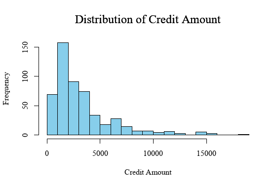

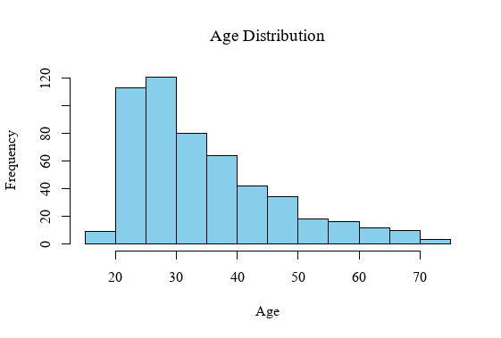

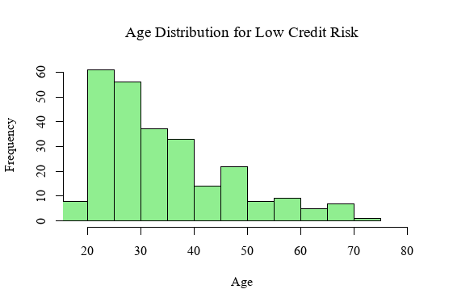

#### Comparisons

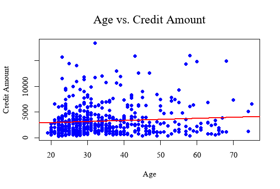

#### PairWise

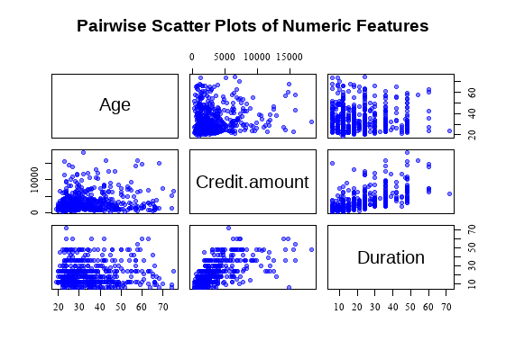

### 2️⃣ Credit Amount by Housing Type
Visualizing how credit amounts differ based on housing status.

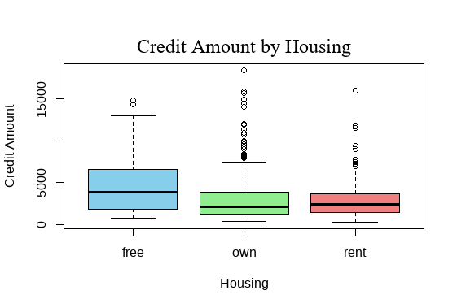

### &#51;&#xFE0F;&#x20E3; Credit Amount by Purpose 
Visualizing how credit amounts differ based on purpose.

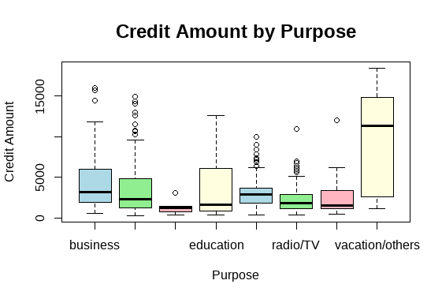

### &#52;&#xFE0F;&#x20E3; Credit Amount by Saving 
Visualizing how credit amounts differ based on Saving.

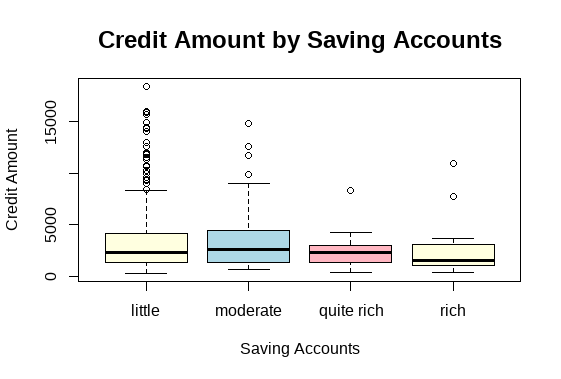


###  &#53;&#xFE0F;&#x20E3;  Correlation Matrix

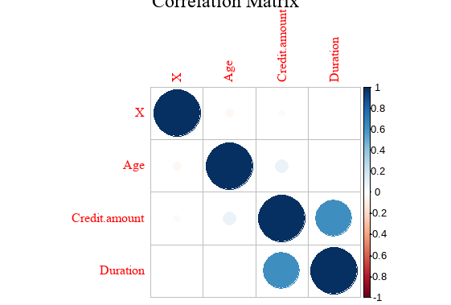

### Correlation Heatmap
Highlights relationships between numerical variables.

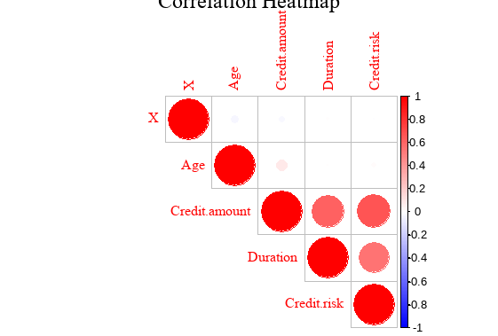

### &#54;&#xFE0F;&#x20E3; ROC Curve for Model Performance
Evaluates classification performance for different models.

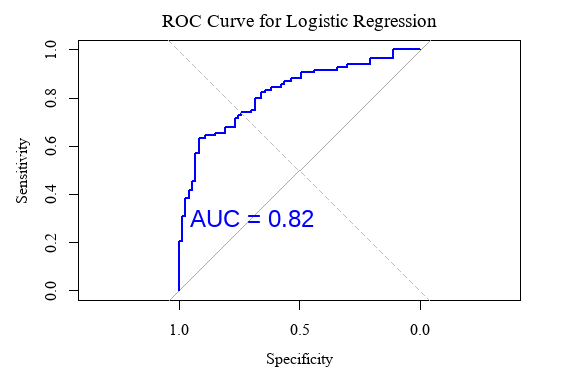

### &#55;&#xFE0F;&#x20E3; Feature Importance (Random Forest & XGBoost)
Shows the most important variables influencing credit risk prediction.

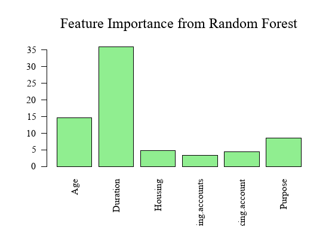

## 🚀 Results & Key Findings
- **Age and Duration** have a strong impact on credit risk assessment.
- **Housing and Checking Account Balance** are key determinants in predicting loan defaults.
- **Random Forest and XGBoost** outperform Logistic Regression in predictive accuracy.
- **AUC Score Comparison:**
  - Logistic Regression: **0.76**
  - Random Forest: **0.84**
  - XGBoost: **0.87**

## 🔧 Installation & Usage
### 1️⃣ Install Required Libraries
```r
install.packages(c("ggplot2", "corrplot", "pROC", "randomForest", "xgboost", "caret", "shap"))
library(ggplot2)
library(corrplot)
library(pROC)
library(randomForest)
library(xgboost)
library(caret)
library(shap)
```
### 2️⃣ Load the Dataset
```r
data <- read.csv("credit_data.csv")
```
### 3️⃣ Run the Analysis
```r
source("credit_risk_analysis.R")
```

## 📜 Conclusion
This project successfully predicts credit risk using advanced statistical and machine learning techniques. The results show that ensemble models like **Random Forest and XGBoost** significantly improve predictive accuracy.

## 💡 Future Improvements
- Hyperparameter tuning for better model optimization.
- Deploying the model as an API for real-time risk prediction.
- Exploring deep learning approaches for credit scoring.

## 👨‍💻 Author
- **Joel Mande**
- LinkedIn: https://linkedin.com/in/wajoel
- GitHub: https://github.com/wajoel

